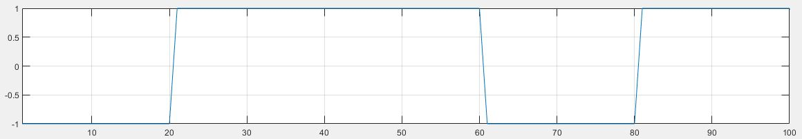
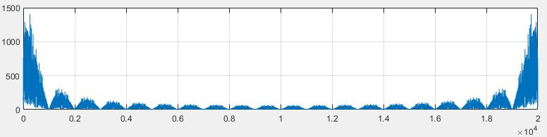
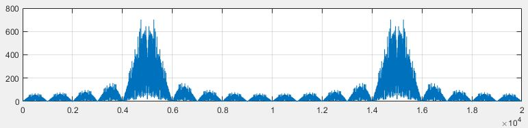
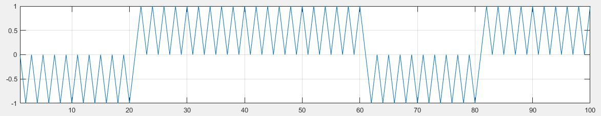
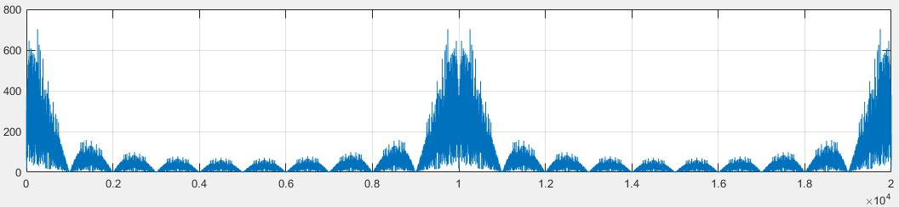
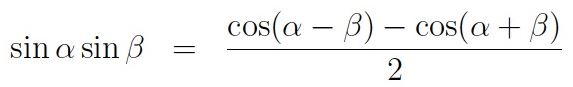
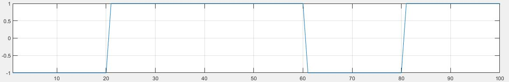
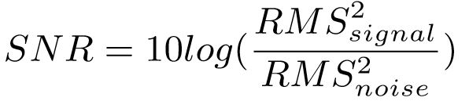

## Для проведения измерений необходимо:
* сгенерировать битовую последовательность
  - в качестве генератора битовой последовательности выступает функция матлаб `randi([0, 1]);`
    
* выполнить операцию NRZ
  - для операции NRZ достаточно в битовой последовательности заменить нули минус единицами
    > например, битовая последовательность `1 1 0 1 1` преобразуется в `1 1 -1 1 1`
  
    
* интерполировать с неким коэффициентом интерполяции
  - интерполяция последовательно повторяет значения сигнала 
    > например, если битовая последовательность имела вид `1 1 -1 1 1`, то после интерполяции
    > в два раза последовательность будет иметь вид `1 1 1 1 -1 -1 1 1`

    
* перенести последовательность на несущую частоту
  - перенос на несущую по сути означает умножение последовательности на синусоиду определенной частоты
    - интерполированная в 20 раз битовая последовательность
  
    
    - спектр интерполированной последовательности

  
  
    - несущий сигнал (синусоида)
  
    - перенос интерполированной последовательности на несущую
  
  
    - спектр перенесенной на несущую последовательности

  
> полученный массив можно загружать на ЦАП. По полученным цифровым данным ЦАП сгенерирует аналоговый сигнал, который
> выходит с канала один. На втором канале ЦАП генерируется шум, который суммируется с рассматриваемым сигналом. Их сумма
> подаётся на осциллограф

На приёмной строне, с осциллографа снимается последовательность таких сигналов следующих друг за другом, поэтому
при снятии получается одна большая последовательность следующих друг за другом одинаковых сигналов. Возникает вопрос, как узнать
где начало последовательности? Для этого используется корреляция. Корреляция сравнивает опорный сигнал (тот, что был отправлен) и
полученный с осциллографа. в функции MATLAB xcorr на выход выдаются два массива - собственно значения корреляций и задержки
соответствующие этим значениям корреляций.

После нахождения нужного массива из принятых данных необходимо "снять" с несущей частоты, т.е. перенести на нулевую частоту.
Делается это все также перемножением сигнала на несущую.

На несущей:
  

На нулевой частоте (после умножения на несущую):

При этом если посмотрим спектр снятой с несущей последовательности, то увидим высокочастотную составляющую
с частотой в два раза больше несущей

Откуда взялась эта частота? Т.к. мы умножали два синуса с одинаковыми частотами

a + b = a + a = 2a. Это и есть высокочастотный косинус. При помощи фильтрации путём интегрирования убирается высокочастотная составляющая:

Получив такой массив необходимо произвести операцию децимации ("прореживание"), что является противоположностью
интерполяции. При коэффициенте интерполяции 20 процесс децимации заключается в вырезании каждого двадцатого отсчёта 
из массива

## Измерение BER vs SNR

функция `getRMS` является главным скриптом и запускается уже после генерации массива. 

`[SNRList, BERList] = getSNR(wgID, osciID, sigAmpList, noiseAmpList, params)`

после запуска функции `getSNR` внутри нее запускается цикл `for`, который пробегает все значения списка
`sigAmpList` и `noiseAmpList`, которые являются значениями амплитуды, которые будут принимать сигнал и шум, генерируемые
генератором волн (ЦАП). При этом для начала отключаются оба канала генератора при помощи функции `channelOnOff`, которая подключается
к генератору при помощи идентификатора `wgID`. Затем на канале 1 функция `channelAmp` выставляет первое значение амплитуды из списка `sigAmpList`, а дальше функция 
`channelOnOff`, включает канал 1. Сигнал с канала 1 поступает в сумматор, в котором пока что шума нет, и дальше в осциллограф.
Функция `getRMS` подкючается к осциллографу через идентификатор `osciID` и снимает значение среднеквадратичного значения напряжения
сигнала (Root Mean Square) и сохраняет его в свою переменную. Далее канал 1 выключается, а на канале два функция `genNoise` включает встроенный в 
генератор шум с некоторой произвольной амплитудой. Функция `channelAmp` выставляет первое значение амплитуды из списка `noiseAmpList` и затем
функция `channelOnOff` включает канал 2. Шум поступает в сумматор, в котором пока нет сигнала, а затем на осциллограф. Функция `getRMS` 
снимает среднеквадратичное значение напряжения шума и сохраняет в свою переменную. Функция `channelOnOff` выключает канал 2.
Полученные значения напряжения позволяют подсчитать значение SNR по известной формуле:

 
 
После подсчёта SNR его значение записывается как первое значение массива `SNRList`. Далее включаются каналы 1 и 2 и на сумматор 
поступают уже и сигнал и шум, которые затем поступают в осциллограф. Функция `getFromOsci` снимает смешанный сигнал с осциллографа
и передает его на вход функции `dem` (демодулятор) вместе с пакетом params, в котором записаны данные сгенерированного сигнала, необходимые для 
демодуляции, а именно:
- массив, отправленный на ЦАП
- несущая
- коэффициент интерполяции
- битовая последовательность до NRZ

в демодуляторе принятый с осциллографа сигнал коррелируется с массивом отправленным на ЦАП, и затем вырезается цельный кусок, длиной
равной отправленному. Далее вырезанный массив перемножается с несущей, для переноса на нулевую частоту. Затем происходит фильтрация
высокочастотной составляющей с использованием коэффициента интерполяции и децимация с использованием коэффициента интерполяции. После происходит
процедура обратная NRZ, подсчёт ошибок происходит из сравнения с битовой последовательностью до NRZ. Подсчитанные ошибки BER подаются на выход
функции демодулятора `dem` и заносятся в список `BERList`. Так завершается первая итерация цикла `for`.
По окончании цикла функции `getSNR` формируются два списка `SNRList` и `BERList`.
