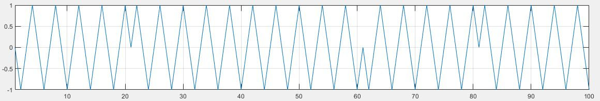

## Для проведения измерений необходимо:
* сгенерировать битовую последовательность
  - в качестве генератора битовой последовательности выступает функция матлаб `randi([0, 1]);`
    
* выполнить операцию NRZ
  - для операции NRZ достаточно в битовой последовательности заменить нули минус единицами
    > например, битовая последовательность `1 1 0 1 1` преобразуется в `1 1 -1 1 1`
  
    
* интерполировать с неким коэффициентом интерполяции
  - интерполяция последовательно повторяет значения сигнала 
    > например, если битовая последовательность имела вид `1 1 -1 1 1`, то после интерполяции
    > в два раза последовательность будет иметь вид `1 1 1 1 -1 -1 1 1`

    
* перенести последовательность на несущую частоту
  - перенос на несущую по сути означает умножение последовательности на синусоиду определенной частоты
    - интерполированная в 20 раз битовая последовательность
  
    - несущий сигнал (синусоида)
  
    - перенос на несущую
  
> полученный массив можно загружать на ЦАП. По полученным цифровым данным ЦАП сгенерирует аналоговый сигнал, который
> выходит с канала один. На втором канале ЦАП генерируется шум, который суммируется с рассматриваемым сигналом. Их сумма
> подаётся на осциллограф

На приёмной строне, с осциллографа снимается последовательность таких сигналов следующих друг за другом, поэтому
при снятии получается одна большая последовательность следующих друг за другом одинаковых сигналов. Возникает вопрос, как узнать
где начало последовательности? Для этого используется корреляция. Корреляция сравнивает опорный сигнал (тот, что был отправлен) и
полученный с осциллографа. в функции MATLAB xcorr на выход выдаются два массива - собственно значения корреляций и задержки
соответствующие этим значениям корреляций.

После нахождения нужного массива из принятых данных необходимо "снять" с несущей частоты, т.е. перенести на нулевую частоту.
Делается это все также перемножением сигнала на несущую.

функция `getRMS` является главным скриптом и запускается уже после генерации массива.

